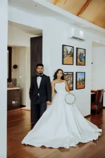

# Haymi & Messi — wedding flipbook

A page-turning wedding album that runs in the browser: black stock, gold leaf,
photographs running edge to edge, and pages that bow as they turn. Plain HTML,
CSS and JavaScript — no build step, no framework, no dependencies. Open
`index.html` and it works, including straight off a USB stick.



## Viewing it

Double-click `index.html`, or serve the folder:

```sh
python3 -m http.server 8000    # then open http://localhost:8000
```

**Turning pages:** click the left or right half of the book, use the arrow
keys, swipe on a touch screen, or press <kbd>Play</kbd> to let it turn itself.
<kbd>Home</kbd> and <kbd>End</kbd> jump to the covers, <kbd>C</kbd> opens the
contents grid. Every photograph has its own link — `index.html#p=17` opens
straight to number 17.

The book fills the window. On a wide screen it opens as a two-page spread;
below 800px it becomes a single page, so it reads properly on a phone. The
controls fade out after a few seconds of stillness and return on any movement.

### The covers

Both covers are made out of the album itself: a close cutout of every
photograph, tiled six across, dimmed and tinted. Each tile is zoomed past its
frame so it reads as a fragment rather than a shrunken copy of the picture.
The front carries the names, the back the monogram, and the cutouts run in
reverse order on the back so the two are a pair rather than a repeat. They are
built from the contents thumbnails, so they cost nothing extra to load.

### How the page turn works

A page swinging on a hinge as a flat plane never looks like paper. So a leaf in
flight is taken out and replaced by a copy of itself sliced into vertical
strips (`curlScaffold` and `paintCurl` in `assets/js/flipbook.js`).

The strips are *chained* rather than pivoted about a common hinge: each one
starts where the last one ended and carries its own angle, so the sheet keeps
its length and can take any shape. The shape comes from letting the free edge
lead — every strip runs the same turn, but the ones nearer the spine start
later (`LAG`). The outer edge lifts first, the fold rolls inward, and the paper
is flat again by the time it lands. Each strip is shaded by how square-on it
faces the reader, which lights the curve itself.

That travelling fold is the whole difference. An earlier version rotated the
sheet rigidly and swelled a fixed arch inside it: the shape never changed, only
its size, and however much you bowed it, it still read as a turning board. The
sheet now holds a 40–70° bow all the way through the turn, and foreshortens
from full width to nothing as it stands up and passes vertical.

Four things matter for it feeling smooth, and each of them was worth more than
raw frame rate:

- **The slices must paint identically to the page they stand in for.** An
  earlier version skipped the paper grain on the slices because a blend mode
  twenty times over is expensive — which meant the texture visibly popped off
  at the start of every turn and back on at the end. The grain is gone
  entirely now.
- **The strips are built once and kept.** Creating twenty freshly composited
  layers at the start of each turn was what made the first frames stutter.
- **Only the leaves within two of the reader stay in the DOM.** Every live leaf
  is two backface-hidden faces in their own 3D context, and all of them
  re-composite on every frame; keeping all thirty-eight cost about seven frames
  a second.
- **The shade overlay owns its layer.** Without that, changing its opacity each
  frame repaints the page slice underneath it.

`LAG`, `STRIPS` and `--turn` are the three knobs worth touching if the motion
wants tuning. `LAG` of 0 is a rigid board; much past 0.3 and the page curls up
like a scroll rather than turning.

## What's in here

```
index.html               the page
assets/css/style.css     all of the styling
assets/js/flipbook.js    the page-turning engine
assets/js/photos.js      generated manifest — do not edit by hand
photos/                  web-sized images (4.9 MB total)
photos/thumbs/           contents-grid thumbnails
images/                  camera originals (git-ignored, ~1.7 GB)
tools/order.txt          the running order, chapters and alt text
tools/build-photos.sh    rebuilds photos/ and the manifest from images/
```

The originals are ~60 megapixel JPEGs, up to 130 MB each. They are far too
large to hand to a browser, so `tools/build-photos.sh` resizes each one to
1600px on its longest side and converts it to WebP — 1.7 GB becomes 4.9 MB,
with no visible loss at the size a page is actually displayed.

## Changing the album

**To reorder, add or remove photographs**, edit `tools/order.txt` — one line
per photograph, in the order they should appear:

```
filename in images/ | chapter | caption | alt text
```

Chapter and caption are printed on the page, and only on the photograph that
opens a chapter; leave them empty on every other line. Then rebuild:

```sh
./tools/build-photos.sh          # needs macOS `sips` and `cwebp`
```

`cwebp` comes from `brew install webp`. The script regenerates `photos/`,
`photos/thumbs/` and `assets/js/photos.js`, so nothing needs editing by hand.

No page has a border and nothing is squeezed onto a mat. A landscape
photograph is given a whole spread — one picture printed across the gutter,
the way an album does it — so it runs the full width of the open book. An
upright photograph fills its own page.

Because a spread has to begin on a left-hand page, the running order is
nudged to suit: where a wide frame would land on a right-hand page, the next
upright one is brought forward to face it rather than leaving a blank. That
order is worked out once and used by both layouts, so a photograph keeps its
number either way, and chapter titles are re-hung on whichever photograph ends
up opening their chapter.

Every other photograph fills its page completely, cropped to fit. The one
exception is a landscape photograph on a phone: a tall screen would keep only
about a third of its width, which would destroy the picture, so those nine are
shown whole over an enlarged, blurred, darkened copy of themselves. `FILL_LIMIT`
in `assets/js/flipbook.js` is the line between the two — how much of a
photograph may be cropped away before it is shown whole instead. It is measured
against the actual window every time the layout changes, not baked in.

**To change the names or the closing note**, edit the `COUPLE` constant and
`buildEnd()` in `assets/js/flipbook.js`, and the headings in `index.html`.

**To change the colours**, the whole palette is the custom properties at the
top of `assets/css/style.css` — `--page`, `--ink`, `--gold` and friends.

**To add music**, drop an mp3 at `assets/audio/theme.mp3`. A Music toggle
appears in the toolbar on its own; with no file there, no button is shown.

## Publishing it

The whole thing is static, so anywhere that serves files will do — GitHub
Pages, Netlify, Vercel, or a folder on any web host. For GitHub Pages: push the
repository, then turn on Pages for the `main` branch in Settings. Note that
`images/` is git-ignored, so only the 4.9 MB of web-sized photographs are
uploaded, not the 1.7 GB of originals.

The album loads its fonts from Google Fonts, but not in a way that can hold it
up: the stylesheet is fetched without blocking the first paint, so on a venue's
wifi the album opens immediately in Georgia and upgrades to Cormorant if and
when the fonts arrive. It has been checked with the network off.
